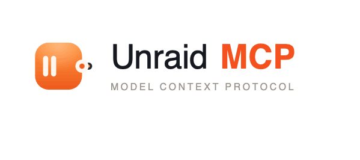

<p align="center">
  <picture>
    <source media="(prefers-color-scheme: dark)" srcset="docs/icons/unraid-mcp-lockup-dark.png">
    
  </picture>
</p>

An [MCP](https://modelcontextprotocol.io) server that hooks your **Unraid** box up to
MCP-aware agents (Claude Desktop, the `hermes` harness, whatever) through Unraid's
official **GraphQL API**.

It's **read-only by default** — the monitoring tools are always on, and anything that
can change the server is opt-in and asks for confirmation. Your API key never gets
logged. The details are in [docs/security.md](docs/security.md).

> Needs Unraid 7.2+ (the API is built in) or the Unraid Connect plugin on older versions.

## What you get

Read-only tools for the stuff you'd actually want to check: system info, array and
disk health, parity, Docker containers/networks, VMs, shares, notifications, UPS,
network interfaces, and a one-shot `get_health_summary` for quick triage.

Opt-in mutating tools (start/stop the array, control Docker/VMs, run parity checks,
manage notifications) only show up when you set `UNRAID_MCP_ALLOW_MUTATIONS=true`, and
every one of them needs `confirm=true`.

The full tool catalog and agent-side conventions live in
[docs/llm-usage.md](docs/llm-usage.md).

## Quick start

### Docker (easiest)

The image is on Docker Hub as
[`dtarakanov/unraid-mcp`](https://hub.docker.com/r/dtarakanov/unraid-mcp) (multi-arch).
It runs the streamable-HTTP transport on port 6750.

```bash
docker run --rm -p 6750:6750 \
  -e UNRAID_API_URL=https://yourhash.myunraid.net/graphql \
  -e UNRAID_API_KEY=your-api-key \
  -e UNRAID_MCP_BEARER_TOKEN=$(openssl rand -hex 32) \
  dtarakanov/unraid-mcp:latest
```

Or grab [`docker-compose.yml`](docker-compose.yml), fill in the values, and
`docker compose up -d`.

Use a URL whose hostname matches the Unraid certificate. The MyUnraid hostname
shown by Unraid usually works with `UNRAID_VERIFY_SSL=true`. If you use a LAN IP
URL and the cert does not include that IP, a CA bundle cannot fix hostname
validation; use a matching cert/hostname or set `UNRAID_VERIFY_SSL=false` only
on a trusted LAN.

### Local (for stdio clients)

```bash
git clone https://github.com/tarakanof/Unraid-MCP
cd Unraid-MCP
uv sync
uv run unraid-mcp        # stdio transport (the default)
```

(`python -m unraid_mcp` also works once the venv is activated.)

### On Unraid (bundled template)

To run it *on* Unraid, talking back to the same box, use the ready-made
Community-Apps template at [`deploy/unraid/unraid-mcp.xml`](deploy/unraid/unraid-mcp.xml).
Install it as a **user template**: copy that file into
`/boot/config/plugins/dockerMan/templates-user/` on the flash drive, then
**Docker → Add Container** and pick **unraid-mcp** from the *Template* dropdown —
every field is pre-filled. The full walkthrough — API key, bearer token, the TLS
setting, and a few ways to get the file onto the box — is in
[deploy/unraid/](deploy/unraid/).

## Configure

Two variables are required:

- `UNRAID_API_URL` — your GraphQL endpoint, e.g. `https://yourhash.myunraid.net/graphql`
- `UNRAID_API_KEY` — an Unraid API key (a `guest`/read key is plenty for monitoring)

Copy `.env.example` to `.env` for a starting point. Everything else — transports, TLS,
the safety switches — is in [docs/configuration.md](docs/configuration.md).

## Connect a client

Local stdio clients launch the server themselves:

```json
{
  "mcpServers": {
    "unraid": {
      "command": "uv",
      "args": ["run", "--directory", "/path/to/unraid-mcp", "unraid-mcp"],
      "env": {
        "UNRAID_API_URL": "https://yourhash.myunraid.net/graphql",
        "UNRAID_API_KEY": "your-api-key"
      }
    }
  }
}
```

Claude Desktop uses the same `mcpServers` shape. For remote/HTTP, point the client at
`http://<host>:6750/mcp` and send `Authorization: Bearer <token>`. Put the HTTP
transport behind TLS before exposing it beyond localhost or a trusted LAN.

Writing an agent against this? [docs/llm-usage.md](docs/llm-usage.md) has the tool
catalog, conventions, and a drop-in system-prompt snippet.

## Develop

```bash
uv sync --extra dev
uv run pytest        # all mocked — no live server needed
uv run ruff check .
uv run ruff format .
```

Tests mock the GraphQL endpoint with `respx`, so the suite runs without a real Unraid
server. The logic functions are kept pure and testable; the `@mcp.tool` wrappers are
thin.

The Docker image builds and pushes to Docker Hub automatically when a GitHub Release is
published — see [`.github/workflows/docker-publish.yml`](.github/workflows/docker-publish.yml).

## Docs

- [docs/configuration.md](docs/configuration.md) — every environment variable, transports, TLS
- [docs/security.md](docs/security.md) — the security model
- [docs/llm-usage.md](docs/llm-usage.md) — tool catalog + guide for LLM agents
- [deploy/unraid/](deploy/unraid/) — running it on Unraid

## License

MIT — see [LICENSE](LICENSE).
